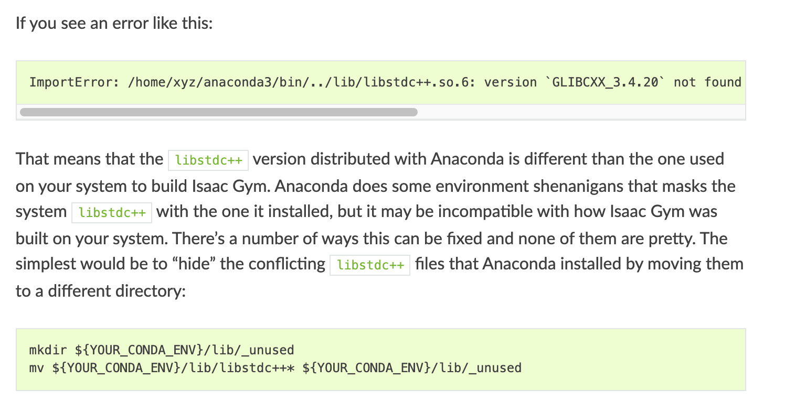

# Detailed installation instructions

```
git clone git@github.com:PKU-MARL/Safe-Policy-Optimization.git
Safe-Policy-Optimization
conda create -n safepo python=3.8
conda activate safepo
pip install -e .
conda install mpi4py
# install pytorch according to your cuda version
pip install torch==1.9.0+cu111 torchvision==0.10.0+cu111 torchaudio==0.9.0 -f https://download.pytorch.org/whl/torch_stable.html
```

## install mujoco
```
Download mujoco200 linux from http://www.roboti.us/download.html
Download Activation key from http://www.roboti.us/license.html
mkdir ~/.mujoco
mv mujoco200_linux.zip ~/.mujoco
mv mjkey.txt ~/.mujoco/
cd ~/.mujoco
unzip mujoco200_linux.zip
mv mujoco200_linux mujoco200
cp mjkey.txt ~/.mujoco/mujoco200
cp mjkey.txt ~/.mujoco/

Please add following line to .bashrc:
export LD_LIBRARY_PATH=$LD_LIBRARY_PATH:~/.mujoco/mujoco200/bin
source ~/.bashrc
pip install mujoco_py==2.0.2.7

```

## install IsaacGym
```
Details regarding installation of IsaacGym can be found [here](https://developer.nvidia.com/isaac-gym). We currently support the `Preview Release 3` version of IsaacGym.
Ensure that Isaac Gym works on your system by running one of the examples from the `python/examples`
directory, like `joint_monkey.py`. Follow troubleshooting steps described in the Isaac Gym Preview 2
install instructions if you have any trouble running the samples.
```


# Known issues

## Problem 1
```
ImportError: /lib/x86_64-linux-gnu/libstdc++.so.6: version `GLIBCXX_3.4.29' not found (required by /home/jiamg/miniconda3/envs/safepo/lib/python3.8/site-packages/pandas/_libs/window/aggregations.cpython-38-x86_64-linux-gnu.so)
```
solution
```
conda install libgcc
```

## Another version of Problem 1 
If you see an error like this:
```
ImportError: /home/xyz/anaconda3/bin/../lib/libstdc++.so.6: version `GLIBCXX_3.4.20` not found (required by /home/xyz/carbgym/python/isaacgym/_bindings/linux64/gym_36.so)
```
That means that the libstdc++ version distributed with Anaconda is different than the one used on your system to build Isaac Gym. Anaconda does some environment shenanigans that masks the system libstdc++ with the one it installed, but it may be incompatible with how Isaac Gym was built on your system. There’s a number of ways this can be fixed and none of them are pretty. The simplest would be to “hide” the conflicting libstdc++ files that Anaconda installed by moving them to a different directory:
```
mkdir ${YOUR_CONDA_ENV}/lib/_unused
mv ${YOUR_CONDA_ENV}/lib/libstdc++* ${YOUR_CONDA_ENV}/lib/_unused
```
This issue also appears in the official NVIDIA Isaac Gym installation documentation.



## Problem 2
```
/tmp/pip-install-ibsk3pie/mujoco-py_86d5be32b0b64b41b92097c8bb522d0a/mujoco_py/gl/osmesashim.c:1:10: fatal error: GL/osmesa.h: No such file or directory
          1 | #include <GL/osmesa.h>
            |          ^~~~~~~~~~~~~
      compilation terminated.
      error: command '/usr/bin/gcc' failed with exit code 1
      [end of output]
```
sudo apt install libosmesa6-dev

## Problem 3
```
error: [Errno 2] No such file or directory: 'patchelf'
      [end of output]
```
```
sudo apt-get -y install patchelf
```

