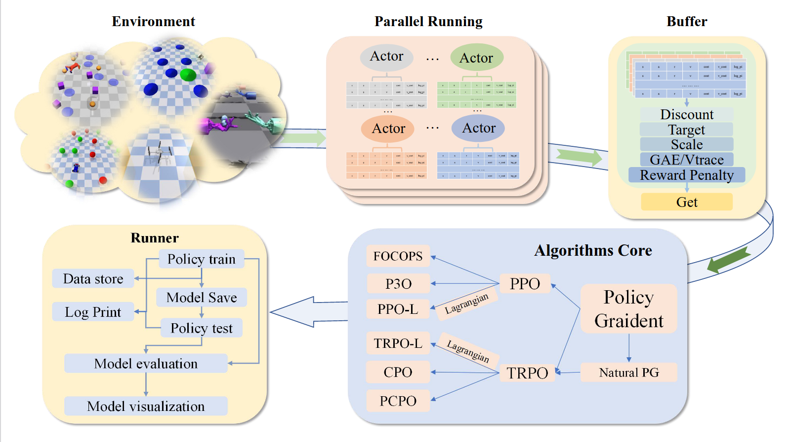

<div align="center">
  
</div>

<div align="center">

[](https://github.com/PKU-Alignment)
[](#license)

</div>

**Safe Policy Optimization (SafePO)**  is a comprehensive algorithm benchmark for Safe Reinforcement Learning (Safe RL). It provides RL research community with a unified platform for processing and evaluating algorithms in various safe reinforcement learning environments. In order to better help the community study this problem, SafePO is developed with the following key features:

- **Comprehensive Safe RL benchmark**: We offer high-quality implementation of both single-agent safe reinforcement learning algorithms (CPO, PCPO, FOCOPS, PPO-Lag, TRPO-Lag, CUP, CPPO-PID, and RCPO) and multi-agent safe reinforcement learning algorithms (HAPPO, MAPPO-Lag, IPPO, MACPO, and MAPPO).
- **Richer interfaces**：In SafePO, you can modify the parameters of the algorithm according to your requirements. You can pass in the parameters you want to change via ``argparse`` at the terminal.
- **Single file style**：SafePO adopts a single-file style to implement algorithms, aiming to function as an algorithm library that integrates tutorial and tool capabilities. This design choice prioritizes readability and extensibility, albeit at the expense of inheritance and code simplicity. Unlike modular frameworks, users can grasp the essence of the algorithms without the need to extensively navigate through the entire library.
- **More information**：We provide rich data visualization methods. Reinforcement learning algorithms typically involves huge number of parameters. In order to better understand the changes of each parameter in the training process, we use log files, [TensorBoard](https://www.tensorflow.org/tensorboard), and [wandb](https://wandb.ai/) to visualize them. We believe this will help developers tune each algorithm more efficiently.

<div align=center>
    
</div>

- [Overview of Algorithms](#overview-of-algorithms)
- [Supported Environments](#supported-environments)
- [Safety-Gymnasium](#safety-gymnasium)
- [Safe-Dexterous-Hands](#safe-dexterous-hands)
  - [Prerequisites](#prerequisites)
  - [Selected Tasks](#selected-tasks)
- [What's More](#whats-more)
- [Pre-requisites](#pre-requisites)
- [Conda-Environment](#conda-environment)
- [Getting Started](#getting-started)
  - [Single-Agent](#single-agent)
  - [Multi-Agent](#multi-agent)
    - [Safety DexterousHands](#safety-dexteroushands)
    - [Safety-Gymnasium Multi-agent Velocity](#safety-gymnasium-multi-agent-velocity)
    - [Multi-Agent Benchmark](#multi-agent-benchmark)
- [Machine Configuration](#machine-configuration)
- [Ethical and Responsible Use](#ethical-and-responsible-use)
- [PKU-Alignment Team](#pku-alignment-team)

## Overview of Algorithms

Here we provide a table of Safe RL algorithms that the benchmark includes.


|                                 Algorithm                                  |    Proceedings&Cites    |                                 Official Code Repo                                  |                                                         Official Code Last Update                                                          |                                                                      Official Github Stars                                                                      |
| :------------------------------------------------------------------------: | :---------------------: | :---------------------------------------------------------------------------------: | :----------------------------------------------------------------------------------------------------------------------------------------: | :-------------------------------------------------------------------------------------------------------------------------------------------------------------: |
|             [PPO-Lag](https://cdn.openai.com/safexp-short.pdf)             |           :x:           |          [Tensorflow 1 ](https://github.com/openai/safety-starter-agents)           |                           |         [](https://github.com/openai/safety-starter-agents/stargazers)         |
|            [TRPO-Lag](https://cdn.openai.com/safexp-short.pdf)             |           :x:           |           [Tensorflow 1](https://github.com/openai/safety-starter-agents)           |                           |         [](https://github.com/openai/safety-starter-agents/stargazers)         |
|               [CUP](https://arxiv.org/pdf/2209.07089.pdf)               | Neurips 2022 (Cite: 6) |                   [Pytorch](https://github.com/zmsn-2077/CUP-safe-rl)                    |                                       |                     [](https://github.com/zmsn-2077/CUP-safe-rl/stargazers)                     |
|               [FOCOPS](https://arxiv.org/pdf/2002.06506.pdf)               | Neurips 2020 (Cite: 27) |                   [Pytorch](https://github.com/ymzhang01/focops)                    |                                       |                     [](https://github.com/ymzhang01/focops/stargazers)                     |
|                  [CPO](https://arxiv.org/abs/1705.10528)                   |  ICML 2017(Cite: 663)   |                                         :x:                                         |                                                                    :x:                                                                     |                                                                               :x:                                                                               |
|                [PCPO](https://arxiv.org/pdf/2010.03152.pdf)                |   ICLR 2020(Cite: 67)   |                [Theano](https://sites.google.com/view/iclr2020-pcpo)                |                                                                    :x:                                                                     |                                                                               :x:                                                                               |
|                [RCPO](https://arxiv.org/pdf/1805.11074.pdf)                |  ICLR 2019 (Cite: 238)  |                                         :x:                                         |                                                                    :x:                                                                     |                                                                               :x:                                                                               |
|              [CPPO-PID](https://arxiv.org/pdf/2007.03964.pdf)              | Neurips 2020(Cite: 71)  |     [Pytorch](https://github.com/astooke/rlpyt/tree/master/rlpyt/projects/safe)     |                                          |                        [](https://github.com/astooke/rlpyt/stargazers)                        |
|               [MACPO](https://arxiv.org/pdf/2110.02793.pdf)                |    Preprint(Cite: 4)    | [Pytorch](https://github.com/chauncygu/Multi-Agent-Constrained-Policy-Optimisation) |  | [](https://github.com/chauncygu/Safe-Multi-Agent-Isaac-Gym/stargazers) |
|             [MAPPO-Lag](https://arxiv.org/pdf/2110.02793.pdf)              |    Preprint(Cite: 4)    | [Pytorch](https://github.com/chauncygu/Multi-Agent-Constrained-Policy-Optimisation) |  | [](https://github.com/chauncygu/Safe-Multi-Agent-Isaac-Gym/stargazers) |
| [HAPPO (Purely reward optimisation)](https://arxiv.org/pdf/2109.11251.pdf) |  ICLR 2022 (Cite: 10)   |                [Pytorch](https://github.com/cyanrain7/TRPO-in-MARL)                 |                                 |               [](https://github.com/cyanrain7/TRPO-in-MARL/stargazers)               |
| [MAPPO (Purely reward optimisation)](https://arxiv.org/pdf/2103.01955.pdf) |   Preprint(Cite: 98)    |                [Pytorch](https://github.com/marlbenchmark/on-policy)                |                                |              [](https://github.com/marlbenchmark/on-policy/stargazers)              |

## Supported Environments

## Safety-Gymnasium

Here is a list of all the environments Saty-Gymnasiumn support for now; some are being tested in our baselines, and we will gradually release them in later updates. For more details, please refer to [Safety-Gymnasium](https://github.com/PKU-Alignment/safety-gymnasium).

<table border="1">
  <thead>
    <tr>
      <th>Category</th>
      <th>Task</th>
      <th>Agent</th>
      <th>Example</th>
    </tr>
  </thead>
  <tbody>
    <tr>
      <td rowspan="4">Safe Navigation</td>
      <td>Goal[012]</td>
      <td rowspan="4">Point, Car, Doggo, Racecar, Ant</td>
      <td rowspan="4">SafetyPointGoal1-v0</td>
    </tr>
    <tr>
      <td>Button[012]</td>
    </tr>
    <tr>
      <td>Push[012]</td>
    </tr>
    <tr>
      <td>Circle[012]</td>
    </tr>
    <tr>
      <td>Velocity</td>
      <td>Velocity</td>
      <td>HalfCheetah, Hopper, Swimmer, Walker2d, Ant, Humanoid</td>
      <td>SafetyAntVelocity-v1</td>
    </tr>
  </tbody>
</table>

**note**: Safe velocity tasks support both single-agent and multi-agent algorithms, while safe navigation tasks only support single-agent algorithms currently.

## Safe-Dexterous-Hands

**note**: These tasks support multi-agent algorithms only currently.

### Prerequisites

It uses [Anaconda](https://www.anaconda.com/) to create virtual environments.
To install Anaconda, follow instructions [here](https://docs.anaconda.com/anaconda/install/linux/).

Ensure that Isaac Gym works on your system by running one of the examples from the `python/examples` 
directory, like `joint_monkey.py`. Please follow troubleshooting steps described in the Isaac Gym Preview Release 3/4
install instructions if you have any trouble running the samples.


### Selected Tasks

| Base Environments            | Description                                                                                                                                                           | Demo                                                        |
| ---------------------------- | --------------------------------------------------------------------------------------------------------------------------------------------------------------------- | ----------------------------------------------------------- |
| ShadowHandOver               | These environments involve two fixed-position hands. The hand which starts with the object must find a way to hand it over to the second hand.                        |  |
| ShadowHandCatchOver2Underarm | This environment is made up of half ShadowHandCatchUnderarm and half ShadowHandCatchOverarm, the object needs to be thrown from the vertical hand to the palm-up hand |    |

**We implement some different constraints to the base environments, expanding the setting to both single-agent and multi-agent.**


## What's More

Our team has also designed a number of more interesting safety tasks for two-handed dexterous manipulation, and this work will soon be releasing code for use by more Safe RL researchers.
| Base Environments                    | Description | Demo                                                                       |
| ------------------------------------ | ----------- | -------------------------------------------------------------------------- |
| ShadowHandOverWall                   | None        |            |
| ShadowHandOverWallDown               | None        |       |
| ShadowHandCatchOver2UnderarmWall     | None        |       |
| ShadowHandCatchOver2UnderarmWallDown | None        |  |


## Pre-requisites

To use SafePO-Baselines, you need to install environments. Please refer to [Mujoco](https://mujoco.org/), [Safety-Gymnasium](https://github.com/PKU-Alignment/safety-gymnasium) for more details on installation. Details regarding the installation of IsaacGym can be found [here](https://developer.nvidia.com/isaac-gym). We currently support the `Preview Release 3` version of IsaacGym.

## Conda-Environment

```bash
conda create -n safe python=3.8
conda activate safe
# because the cuda version, we recommend you install pytorch manual.
pip install -e .
```

> For detailed instructions, please refer to [Installation.md](Installation.md).

## Getting Started

### Single-Agent

each algorithm file is the entrance. Running `ALGO.py` with arguments about algorithms and environments does the training. For example, to run PPO-Lag in SafetyPointGoal1-v0 with seed 0, you can use the following command:

```bash
cd safepo/single_agent
python ppo_lag.py --env-id SafetyPointGoal1-v0 --seed 0
```

To run a benchamrk parallelly, for example, you can use the following command to run `PPO-Lag`, `TRPO-Lag` in `SafetyAntVelocity-v1`, `SafetyHalfCheetahVelocity-v1`: 

```bash
cd safepo/single_agent
python benchmark.py --env-id SafetyAntVelocity-v1 SafetyHalfCheetahVelocity-v1 --algo ppo_lag trpo_lag --workers 2
```

The command above will run two processes in parallel, each process will run one algorithm in one environment. The results will be saved in `./runs/`.

Here we provide the list of arguments:

| Argument             	|  Default            	| Info                                                       	|
|----------------------	|---------------------	|------------------------------------------------------------	|
| --seed               	| 0                   	| the random seed of the experiment                          	|
| --device             	| cpu                 	| the device (cpu or cuda) to run the code                   	|
| --torch-threads      	| 4                   	| number of threads for torch                                	|
| --total-steps        	| 10000000            	| total timesteps of the experiments                         	|
| --env-id             	| SafetyPointGoal1-v0 	| the id of the environment                                  	|
| --use-eval           	| False               	| toggles evaluation                                         	|
| --eval-episodes      	| 1                   	| the number of episodes for final evaluation                	|
| --steps-per-epoch    	| 20000               	| the number of steps to run in each environment per rollout 	|
| --update-iters       	| 10                  	| the max iteration to update the policy                     	|
| --batch-size         	| 64/128              	| the number of mini-batches                                 	|
| --entropy-coef       	| 0.0                 	| coefficient of the entropy                                 	|
| --target-kl          	| 0.01/0.02           	| the target KL divergence threshold                         	|
| --max-grad-norm      	| 40.0                	| the maximum norm for the gradient clipping                 	|
| --critic-norm-coef   	| 0.001               	| the critic norm coefficient                                	|
| --gamma              	| 0.99                	| the discount factor gamma                                  	|
| --lam                	| 0.95                	| the lambda for the reward general advantage estimation     	|
| --lam-c              	| 0.95                	| the lambda for the cost general advantage estimation       	|
| --standardized-adv-r 	| True                	| toggles reward advantages standardization                  	|
| --standardized-adv-c 	| True                	| toggles cost advantages standardization                    	|
| --critic-lr          	| 1e-3                	| the learning rate of the critic network                    	|
| --actor-lr           	| 3e-4/None           	| the learning rate of the actor network                     	|
| --log-dir            	| ../runs             	| directory to save agent logs                               	|
| --write-terminal     	| True                	| toggles terminal logging                                   	|
| --fvp-sample-freq    	| 1                   	| the sub-sampling rate of the observation                   	|
| --cg-damping         	| 0.1                 	| the damping value for conjugate gradient                   	|
| --cg-iters           	| 15                  	| the number of conjugate gradient iterations                	|
| --backtrack-iters    	| 15                  	| the number of backtracking line search iterations          	|
| --backtrack-coef     	| 0.8                 	| the coefficient for backtracking line search               	|
| --safety-bound         	| 25.0                	| the cost limit for the safety constraint                   	|

**Note**: Some hyper-parameters are varied for different algorithms. For more details, please refer to the corresponding code files.

### Multi-Agent

We also provide a safe MARL algorithm benchmark for safe MARL research on the challenging tasks of Safety DexterousHands and Safety-Gymnasium multi-agent velocity tasks. HAPPO, IPPO, MACPO, MAPPO-Lag and MAPPO have already been implemented.


#### Safety DexterousHands

`safepo/multi_agent/train_marl.py` is the entrance file. Running `train_hand.py` with arguments about algorithms and tasks does the training. For example, you can use the following command:

```bash
cd safepo/multi_agent
# algo: macpo, mappolag, mappo, happo
python train_hand.py --task=ShadowHandOver --algo=macpo
```

#### Safety-Gymnasium Multi-agent Velocity

**note: This task is still under development. We will release the code as soon as possible.**

`safepo/multi_agent/train_vel.py` is the entrance file. Running `train_vel.py` with arguments about algorithms and tasks does the training. For example, you can use the following command to run `MACPO` in `Safety2x4AntVelocity-v0`, with default arguments:

```bash
cd safepo/multi_agent
# algo: macpo, mappolag, mappo, ippo, happo
python train_vel.py --task=Safety2x4AntVelocity-v0 --algo=macpo
```

The SafePO multi-agent algorithms share almost all hyperparameters for Safety DexterousHands and Safety-Gymnasium multi-agent velocity tasks. However, there are some differences in certain hyperparameters, which are listed below:

| Argument                  	| Info                                        	| Default (for Safety DexterousHands) 	| Default (for Safety-Gymnasium multi-agent velocity) 	|
|---------------------------	|---------------------------------------------	|-------------------------------------	|-----------------------------------------------------	|
| --episode-length          	| Episode length                              	| 8                                   	| 200                                                 	|
| --num-env-steps           	| The number of total steps                   	| 100000000                           	| 10000000                                            	|                              	|
| --n-rollout-threads       	| The number of episodes to run               	| 80                                  	| 32                                                  	|
| --hidden-size             	| The size of hidden layers of neural network 	| 512                                 	| 128                                                  	|
| --entropy-coef            	| The coefficient of entropy                  	| 0.00                                	| 0.01                                                	|
| --use-value-active-masks  	| Whether to use value active masks           	| False                               	| True                                                	|
| --use-policy-active-masks 	| Whether to use policy active masks          	| False                               	| True                                                	|

#### Multi-Agent Benchmark

To run a benchamrk parallelly, for example, you can use the following command to run `MACPO`, `MAPPO` in `Safety2x4AntVelocity-v0`, `Safety6x1HalfCheetahVelocity-v0`: 

```bash
cd safepo/multi_agent
# algo: macpo, mappo
python velocity_benchmark.py --algo macpo mappo --tasks Safety2x4AntVelocity-v0 Safety6x1HalfCheetahVelocity-v0 --workers 1 --exp-name benchmark
```

After running the benchmark, you can use the following command to plot the results:

```bash
cd safepo/multi_agent
python plot.py --logdir ./runs/benchmark
```

To get the evaluation results, you can use the following command:

```bash
cd safepo/multi_agent
python eval.py
```

**Note**: To run a evaluation, you need to modify the `eval.py` file and specify the `basedir`. For example:
  
```python 
basedir = './runs/benchmark'
```

## Machine Configuration

We test all algorithms and experiments on **CPU: AMD Ryzen Threadripper PRO 3975WX 32-Cores** and **GPU: NVIDIA GeForce RTX 3090, Driver Version: 495.44**.

## Ethical and Responsible Use

SafePO aims to benefit safe RL community research, and is released under the [Apache-2.0 license](https://github.com/PKU-Alignment/Safe-Policy-Optimization/blob/main/LICENSE). Illegal usage or any violation of the license is not allowed.

## PKU-Alignment Team

The Baseline is a project contributed by PKU-Alignment at Peking University. We also thank the list of contributors of the following open source repositories:
[Spinning Up](https://spinningup.openai.com/en/latest/), [Bullet-Safety-Gym](https://github.com/SvenGronauer/Bullet-Safety-Gym/tree/master/bullet_safety_gym/envs), [Safety-Gym](https://github.com/openai/safety-gym).
