# SafePO-Baselines

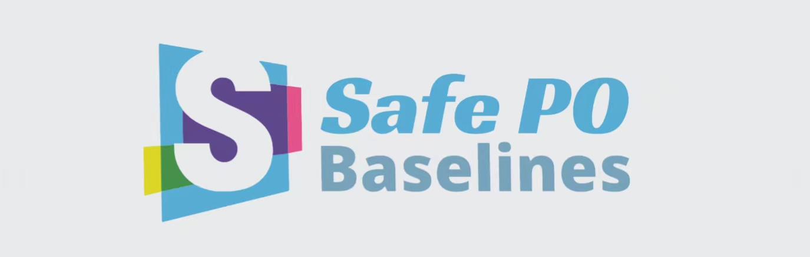

****
[](https://github.com/PKU-MARL "Organization")[](https://github.com/PKU-MARL "Unittest")[](https://github.com/PKU-MARL "Docs")[](https://github.com/PKU-MARL/DexterousHands/blob/main/LICENSE)

**Safe Poicy Optimization (Safe PO)**  is a comprehensive benchmark based on safeRL. It provides RL research community a unified platform for processing and evaluating the ultramodern algorithms in various safe reinforcement learning environments. To better help the community study this problem, Safe PO are developed with the following key features:

- **Comprehensive RL Benchmark**: We offer many safe reinforcement learning algorithms both single agent and muti-agent, including cpo, pcpo, trpo_lagrangian, ppo_lagrangian, focops, macpo, macpo_lagrangian, hatrpo...
- **More richer interfaces**：In safePO, you can  can modify the parameters of the algorithm according to your requirements. We provide customizable YAML files for each algorithm, and you can also pass in the parameters you want to change via argprase at the terminal.
- **More fair, more effective**：In the past, when comparing different algorithms, the number of interactions of each algorithm and the processing mode of buffer may be different. To solve this problem, we abstracted the most basic Policy Graident class and inherited all other algorithms from this class to ensure a more fair and reasonable performance comparison. In order to improve efficiency, we also support the parallelism of multi-core CPU, which greatly improves the efficiency of algorithm development and verification.
- **More infos you can know**：We provide a large number of data visualization interfaces. Reinforcement learning will involve many parameters in the training process. In order to better understand the changes of each parameter in the training process, we use log files and Tensorboard to visualize a large number of parameters in the training process. We think this helps developers tune each algorithm more efficiently.


## Overview of Algorithms
Here we provide a table for Safe RL algorithms that the benchmark concludes.
|Algorithm| Proceedings&Cites | Paper Links |Code URL | Official Code Repo | Official Code Framework | Official Code Last Update | Official Github Stars |
|:-------------:|:------------:|:-------------:|:-------------:|:---------------------------:|:------------:|---------------|---------------|
|PPO Lagrangian | &cross; | [Openai](https://cdn.openai.com/safexp-short.pdf) |[code](https://github.com/PKU-MARL/Safe-Policy-Optimization/blob/main/safepo/algos/ppo_lagrangian.py)| [Official repo](https://github.com/openai/safety-starter-agents) | Tensorflow 1 |  | [](https://github.com/openai/safety-starter-agents/stargazers) |
|TRPO Lagrangian | &cross; | [Openai](https://cdn.openai.com/safexp-short.pdf) |[code](https://github.com/PKU-MARL/Safe-Policy-Optimization/blob/main/safepo/algos/trpo_lagrangian.py)| [Official repo](https://github.com/openai/safety-starter-agents) | Tensorflow 1 |  | [](https://github.com/openai/safety-starter-agents/stargazers) |
|FOCOPS | Neurips 2020 (Cite: 27) | [arxiv](https://arxiv.org/pdf/2002.06506.pdf) |[code](https://github.com/PKU-MARL/Safe-Policy-Optimization/blob/main/safepo/algos/focops.py)| [Official repo](https://github.com/ymzhang01/focops) | pytorch |  | [](https://github.com/ymzhang01/focops/stargazers) |
|CPO | ICML 2017(Cite: 663) | [arxiv](https://arxiv.org/abs/1705.10528) |[code](https://github.com/PKU-MARL/Safe-Policy-Optimization/blob/main/safepo/algos/cpo.py)| &cross; | &cross; | &cross; | &cross; |
|PCPO | ICLR 2020(Cite: 67) | [arxiv](https://arxiv.org/pdf/2010.03152.pdf) |[code](https://github.com/PKU-MARL/Safe-Policy-Optimization/blob/main/safepo/algos/pcpo.py)| [Official repo](https://sites.google.com/view/iclr2020-pcpo) | theano | &cross; | &cross; |
|P3O | IJCAI 2022(Cite: 0) | [arxiv](https://arxiv.org/pdf/2205.11814.pdf) |[code](https://github.com/PKU-MARL/Safe-Policy-Optimization/blob/main/safepo/algos/p3o.py)| &cross; | &cross; | &cross; | &cross; |
|MACPO | Preprint(Cite: 4) | [arxiv](https://arxiv.org/pdf/2110.02793.pdf) |[code](https://github.com/PKU-MARL/Safe-Policy-Optimization/blob/main/safepo/algos/marl/safe-marl-baselines/algorithms/algorithms/macpo_trainer.py)| [Official repo](https://github.com/chauncygu/Multi-Agent-Constrained-Policy-Optimisation) | pytorch |  | [](https://github.com/chauncygu/Safe-Multi-Agent-Isaac-Gym/stargazers) |
|MAPPO_Lagrangian | Preprint(Cite: 4) | [arxiv](https://arxiv.org/pdf/2110.02793.pdf) |[code]()| [Official repo](https://github.com/chauncygu/Multi-Agent-Constrained-Policy-Optimisation) | pytorch |  | [](https://github.com/chauncygu/Safe-Multi-Agent-Isaac-Gym/stargazers) |
|HATRPO | ICLR 2022 (Cite: 10) | [arxiv](https://arxiv.org/pdf/2109.11251.pdf) |[code](https://github.com/PKU-MARL/Safe-Policy-Optimization/blob/main/safepo/algos/marl/safe-marl-baselines/algorithms/algorithms/hatrpo_trainer.py)| [Official repo](https://github.com/cyanrain7/TRPO-in-MARL) | pytorch |  | [](https://github.com/cyanrain7/TRPO-in-MARL/stargazers) |
|HAPPO (Purely reward optimisation) | ICLR 2022 (Cite: 10) | [arxiv](https://arxiv.org/pdf/2109.11251.pdf) |[code](https://github.com/PKU-MARL/Safe-Policy-Optimization/blob/main/safepo/algos/marl/safe-marl-baselines/algorithms/algorithms/happo_trainer.py)| [Official repo](https://github.com/cyanrain7/TRPO-in-MARL) | pytorch |  | [](https://github.com/cyanrain7/TRPO-in-MARL/stargazers) |
|MAPPO (Purely reward optimisation) | Preprint(Cite: 98) | [arxiv](https://arxiv.org/pdf/2103.01955.pdf) |[code](https://github.com/PKU-MARL/Safe-Policy-Optimization/blob/main/safepo/algos/marl/safe-marl-baselines/algorithms/algorithms/mappo_trainer.py)| [Official repo](https://github.com/marlbenchmark/on-policy) | pytorch |  | [](https://github.com/marlbenchmark/on-policy/stargazers) |
|IPPO (Purely reward optimisation) | Preprint(Cite: 28) | [arixiv](https://arxiv.org/pdf/2011.09533.pdf) |[code](https://github.com/PKU-MARL/Safe-Policy-Optimization/blob/main/safepo/algos/marl/safe-marl-baselines/algorithms/algorithms/ippo_trainer.py)| &cross; | &cross; | &cross; | &cross; |

## Supported Environment 

MuJoCo stands for Multi-Joint dynamics with Contact. It is a general purpose physics engine that aims to facilitate research and development in robotics, biomechanics, graphics and animation, machine learning, and other areas which demand fast and accurate simulation of articulated structures interacting with their environment. You can install from [Mujoco github](https://github.com/deepmind/mujoco).

|                             Ant                              |                         Half Cheetah                         |                            Hopper                            |
| :----------------------------------------------------------: | :----------------------------------------------------------: | :----------------------------------------------------------: |
| **State Space: (27,)<br />Action Space: Box(-1.0, 1.0, (8,), float32)** | **State Space: (17,)<br />Action Space:Box(-1.0, 1.0, (6,), float32)** | **State Space: (11,)<br />Action Space:Box(-1.0, 1.0, (3,), float32)** |
|  |  |  |
|                           Humaniod                           |                           Swimmer                            |                           Walker2D                           |
| **State Space:(376,)<br />Action Space:Box(-0.4, 0.4, (17,), float32)** | **State Space: (8,)<br />Action Space:Box(-1.0, 1.0, (2,), float32)** | **State Space: (17,)<br />Action Space:Box(-1.0, 1.0, (6,), float32)** |
|  |  |  |


### Task1: Velocity

#### Task Defination

The goal is for an agent to move along a straight line or a two dimensional plane, but the speed of the robot is constrained for safety purposes.

#### reward

The reward consists of three parts:

- **alive bonus**: Every timestep that the walker is alive, it gets a reward of 1,
- **reward_forward**: A reward of walking forward which is measured as (x-coordinate before action - x-coordinate after action)/dt. *dt* is the time between actions and is dependent on the frame_skip parameter (default is 4), where the *dt* for one frame is 0.002 - making the default dt = 4 \* 0.002 = 0.008. This reward would be positive if the walker walks forward (right) desired.
- **reward_control**: A negative reward for penalising the walker if it takes actions that are too large. It is measured as -coefficient **x** sum(action2) where coefficient is a parameter set for the control and has a default value of 0.001

The total reward returned is **reward** *=* alive bonus + reward_forward + reward_control

#### cost

We obtain the velocity information as follows: 

```python
#next_obs, rew, done, info = env.step(act)
if 'y_velocity' not in info:
	cost = np.abs(info['x_velocity'])
else:
	cost = np.sqrt(info['x_velocity'] ** 2 + info['y_velocity'] ** 2)
```

###  Task2: Circle

#### Task Defination

The goal is for an agent to move along the circumference of a circle while remaining within a safety region smaller than the radius of the circle.

#### reward and cost

We set the circle cost as follows: 

```python
xy_position_before = mass_center(self.model, self.sim)
self.do_simulation(action, self.frame_skip)
xy_position_after = mass_center(self.model, self.sim)

xy_velocity = (xy_position_after - xy_position_before) / self.dt
x_v, y_v = xy_velocity

x_pos, y_pos = xy_position_after[0], xy_position_after[1]
d_xy = np.linalg.norm(xy_position_after, ord=2)
d_o = 10
x_lim = 2.5

# Get reward
reward = (- x_v * y_pos + y_v * x_pos) / (1 + np.abs(d_xy - d_o))

# Get cost
cost = np.float(np.abs(x_pos) > x_lim)
```


### Safety Gym

|                          PointGoal                           |                         PointButton                          |                          PointPush                           |
| :----------------------------------------------------------: | :----------------------------------------------------------: | :----------------------------------------------------------: |
| 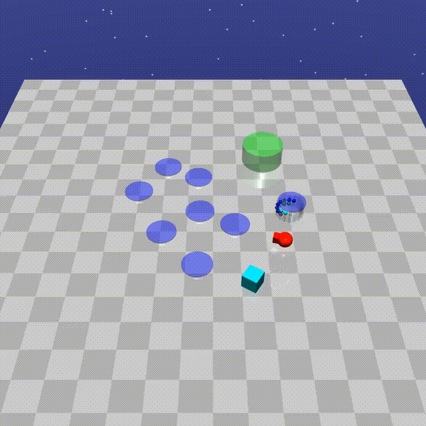 |  |  |
|                         **CarGoal**                          |                        **CarButton**                         |                         **CarPush**                          |
| 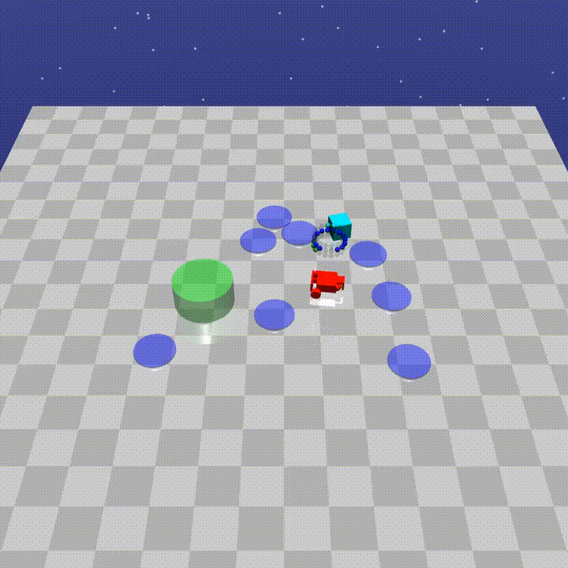 |  |  |
|                        **DoggoGoal**                         |                       **DoggoButton**                        |                        **DoggoPush**                         |
|  |  | 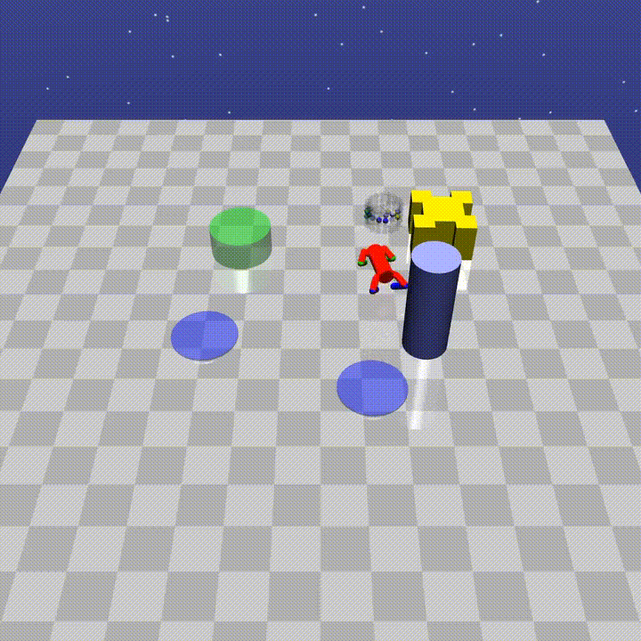 |

#### More details

In each task:Goal, Button, Push, there are three levels of difficulty(with higher levels having more challenging constraints).

- `Safexp-{Robot}Goal0-v0`: A robot must navigate to a goal.

- `Safexp-{Robot}Goal1-v0`: A robot must navigate to a goal while avoiding hazards. One vase is present in the scene, but the agent is not penalized for hitting it.

- `Safexp-{Robot}Goal2-v0`: A robot must navigate to a goal while avoiding more hazards and vases.

- `Safexp-{Robot}Button0-v0`: A robot must press a goal button.

- `Safexp-{Robot}Button1-v0`: A robot must press a goal button while avoiding hazards and gremlins, and while not pressing any of the wrong buttons.

- `Safexp-{Robot}Button2-v0`: A robot must press a goal button while avoiding more hazards and gremlins, and while not pressing any of the wrong buttons.

- `Safexp-{Robot}Push0-v0`: A robot must push a box to a goal.

- `Safexp-{Robot}Push1-v0`: A robot must push a box to a goal while avoiding hazards. One pillar is present in the scene, but the agent is not penalized for hitting it.

- `Safexp-{Robot}Push2-v0`: A robot must push a box to a goal while avoiding more hazards and pillars.

  (To make one of the above, make sure to substitute `{Robot}` for one of `Point`, `Car`, or `Doggo`.) If you want find more information about Safety Gym, you can check [this](https://github.com/openai/safety-gym).

### Safe Bullet Gym

#### Agent

|                             Ball                             |                             Car                              |                            Drone                             |                             Ant                              |
| :----------------------------------------------------------: | :----------------------------------------------------------: | :----------------------------------------------------------: | :----------------------------------------------------------: |
| 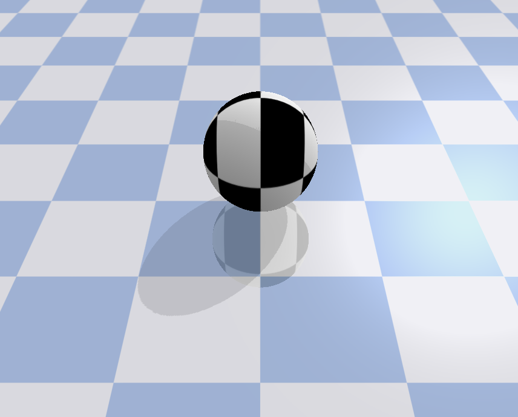 | 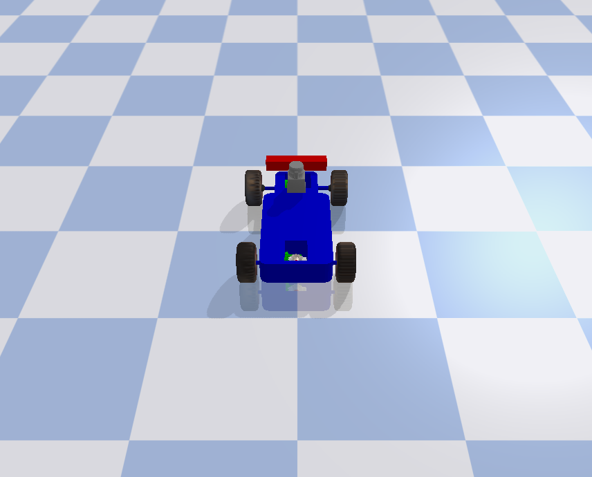 | 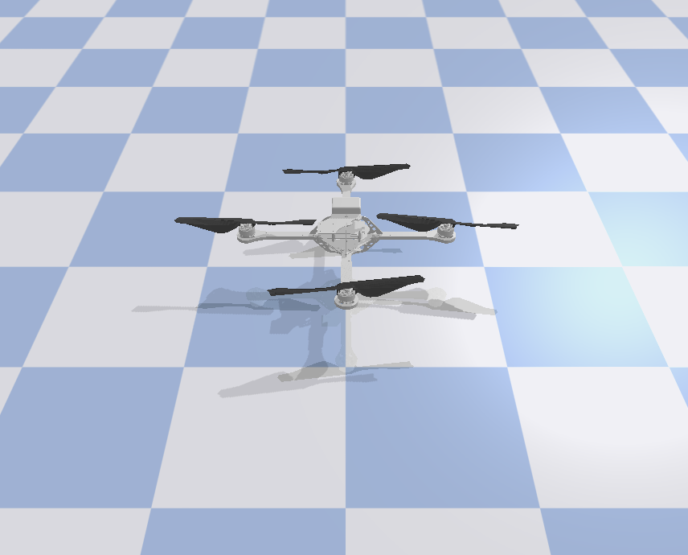 | 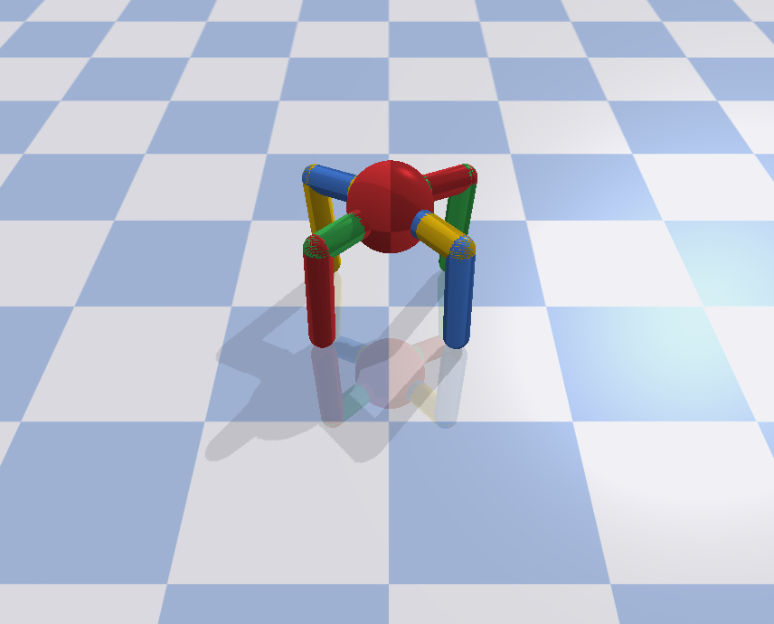 |

#### Task

| Circle                                                       | Gather                                                       | Reach                                                        | Run                                                          |
| ------------------------------------------------------------ | ------------------------------------------------------------ | ------------------------------------------------------------ | ------------------------------------------------------------ |
| 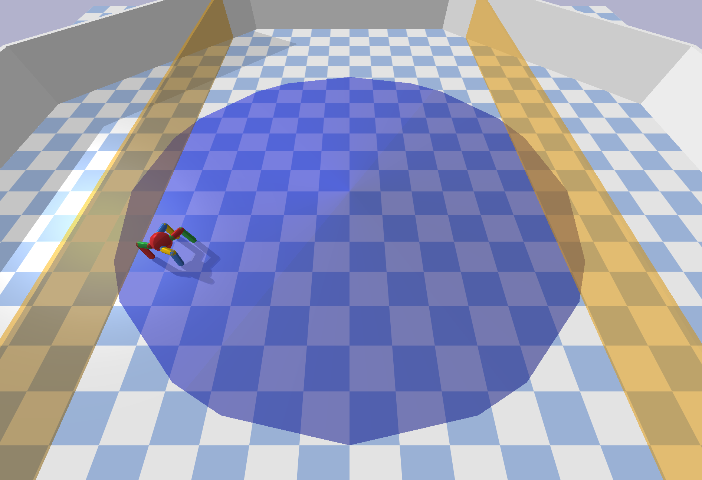 | 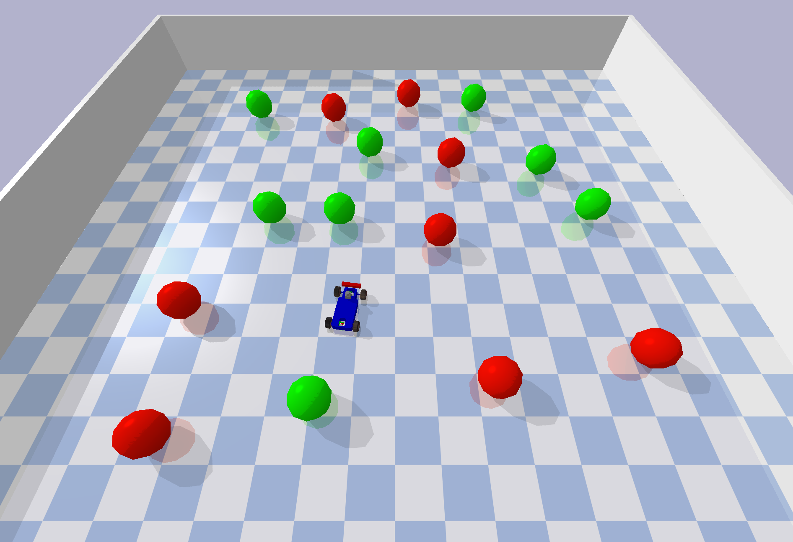 | 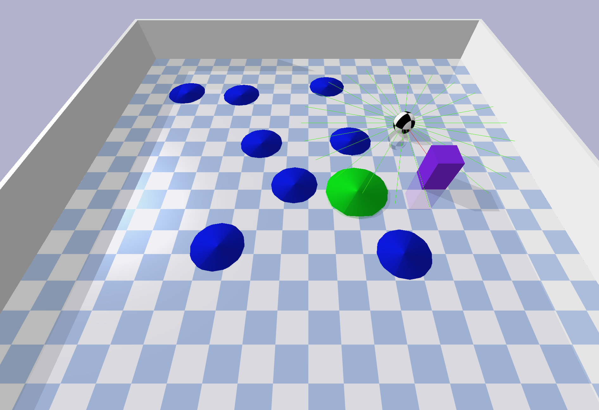 |  |

#### More Description

- **Ball**: A spherical shaped agent which can freely move on the xy-plane.

- **Car**: A four-wheeled agent based on MIT's Racecar.

- **Drone**: An air vehicle based on the AscTec Hummingbird quadrotor.

- **Ant**: A four-legged animal with a spherical torso.

- **Circle**: Agents are expected to move on a circle in clock-wise direction (as proposed by Achiam et al. (2017)). The reward is dense and increases by the agent's velocity and by the proximity towards the boundary of the circle. Costs are received when agent leaves the safety zone defined by the two yellow boundaries.

- **Gather** Agents are expected to navigate and collect as many green apples as possible while avoiding red bombs (Duan et al. 2016). In contrast to the other tasks, agents in the gather tasks receive only sparse rewards when reaching apples. Costs are also sparse and received when touching bombs (Achiam et al. 2017).

- **Reach**: Agents are supposed to move towards a goal (Ray et al. 2019). As soon the agents enters the goal zone, the goal is re-spawned such that the agent has to reach a series of goals. Obstacles are placed to hinder the agent from trivial solutions. We implemented obstacles with a physical body, into which agents can collide and receive costs, and ones without collision shape that produce costs for traversing. Rewards are dense and increase for moving closer to the goal and a sparse component is obtained when entering the goal zone.

- **Run**: Agents are rewarded for running through an avenue between two safety boundaries (Chow et al. 2019). The boundaries are non-physical bodies which can be penetrated without collision but provide costs. Additional costs are received when exceeding an agent-specific velocity threshold.

  If you want to find more information, you can check [this](https://github.com/SvenGronauer/Bullet-Safety-Gym).

## Installation

Because you use this baselines, you need to install environments that you want test. You can check [Mujoco](https://mujoco.org/), [Safety_gym](https://github.com/openai/safety-gym), [Bullet_gym](https://github.com/SvenGronauer/Bullet-Safety-Gym/tree/master/bullet_safety_gym/envs) for more detail to install. Details regarding installation of IsaacGym can be found [here](https://developer.nvidia.com/isaac-gym). We currently support the `Preview Release 3` version of IsaacGym.

### Conda-Environment

```python
conda create -n safe python=3.8
# because the cuda version, we recommend you install pytorch manual.
pip install torch==1.8.0+cu111 torchvision==0.9.0+cu111 torchaudio==0.8.0 -f https://download.pytorch.org/whl/torch_stable.html
pip install -e .
```
### Machine Configuration

We test all algorithms and experiments in CPU: **AMD Ryzen Threadripper PRO 3975WX 32-Cores** and **GPU: NVIDIA GeForce RTX 3090, Driver Version: 495.44**.

## Getting Started
### Single Agent
#### Train
All algorithm codes are in file:Parallel_algorithm, for example, if you want to run ppo_lagrangian in safety_gym:Safexp-PointGoal1-v0, with cpu cores:4, seed:0,

```
python train.py --env_id Safexp-PointGoal1-v0 --algo ppo_lagrangian --cores 4
```
#### Configures
|  Argprase   | default  | info|
|  ----       | ----  | ----|
| --algo       | required | the name of algorithm exec |
| --cores | int| the number of cpu physical cores you use|
| --seed | int| the seed you use|
| --check_freq       | int: 25 | check the snyc parameter |
| --entropy_coef | float:0.01| the parameter of entropy|
| --gamma| float:0.99 | the value of dicount|
| --lam | float: 0.95 | the value of GAE lambda |
| --lam_c| float: 0.95| the value of GAE cost lambda |
| --max_ep_len | int: 1000| unless environment have the default value else, we take 1000 as default value|
| --max_grad_norm| float: 0.5| the clip of parameters|
| --num_mini_batches| int: 16| used for value network tranining|
| --optimizer| Adam | the optimizer of Policy other : SGD, other class in torch.optim|
| --pi_lr | float: 3e-4| the learning rate of policy|
| --steps_per_epoch| int: 32000| the number of interactor steps|
| --target_kl | float: 0.01| the value of trust region|
| --train_pi_iterations| int: 80| the number of policy learn iterations|
| --train_v_iterations| int: 40| the number of value network and cost value network iterations|
| --use_cost_value_function| bool: False| use cost_value_function or not|
|--use_entropy|bool:False| use entropy or not|
|--use_reward_penalty| bool:False| use reward_penalty or not|

E.g. if we want use trpo_lagrangian in environment: with 10 cores and seed:0, we can run the following command:
```
python train.py --algo trpo_lagrangian --env_id Safexp-PointGoal1-v0 --cores 10 --seed 0
```
### Mult-agent
#### About this repository

This repository provides a safe MARL baseline benchmark for safe MARL research on challenging tasks of safety DexterousHands (which is developed for MARL, named as Safe MAIG, for details, see [Safe MAIG](https://github.com/chauncygu/Safe-Multi-Agent-Isaac-Gym)), in which the [MACPO](https://arxiv.org/pdf/2110.02793.pdf), [MAPPO-lagrangian](https://arxiv.org/pdf/2110.02793.pdf), [MAPPO](https://arxiv.org/abs/2103.01955), [HAPPO](https://arxiv.org/abs/2109.11251), [IPPO](https://arxiv.org/abs/2011.09533) are all implemented to investigate the safety and reward performance.


#### Installation

Details regarding installation of IsaacGym can be found [here](https://developer.nvidia.com/isaac-gym). We currently support the `Preview Release 3` version of IsaacGym.

#### Pre-requisites

The code has been tested on Ubuntu 18.04 with Python 3.7. The minimum recommended NVIDIA driver
version for Linux is `470` (dictated by support of IsaacGym).

It uses [Anaconda](https://www.anaconda.com/) to create virtual environments.
To install Anaconda, follow instructions [here](https://docs.anaconda.com/anaconda/install/linux/).

Ensure that Isaac Gym works on your system by running one of the examples from the `python/examples` 
directory, like `joint_monkey.py`. Follow troubleshooting steps described in the Isaac Gym Preview 2 
install instructions if you have any trouble running the samples.

#### install this repo
Once Isaac Gym is installed and samples work within your current python environment, install marl package ```algos/marl``` with:

```bash
pip install -e .
```

#### Running the benchmarks

To train your first policy, run this line in ```algos/marl```:

```bash
python train.py --task=ShadowHandOver --algo=macpo
```

#### Select an algorithm

To select an algorithm, pass `--algo=ppo/mappo/happo/hatrpo` in ```algos/marl``` 
as an argument:

```bash
python train.py --task=ShadowHandOver --algo=macpo
```

#### Select tasks

Source code for tasks can be found in `dexteroushandenvs/tasks`. 

Until now we only suppose the following environments:

|           Environments            |                        ShadowHandOver                        |                   ShadowHandCatchUnderarm                    |                  ShadowHandTwoCatchUnderarm                  |                    ShadowHandCatchAbreast                    |                   ShadowHandOver2Underarm                    |
| :-------------------------------: | :----------------------------------------------------------: | :----------------------------------------------------------: | :----------------------------------------------------------: | :----------------------------------------------------------: | :----------------------------------------------------------: |
|            Description            | These environments involve two fixed-position hands. The hand which starts with the object must find a way to hand it over to the second hand. | These environments again have two hands, however now they have some additional degrees of freedom that allows them to translate/rotate their centre of masses within some constrained region. | These environments involve coordination between the two hands so as to throw the two objects between hands (i.e. swapping them). | This environment is similar to ShadowHandCatchUnderarm, the difference is that the two hands are changed from relative to side-by-side posture. | This environment is is made up of half ShadowHandCatchUnderarm and half ShadowHandCatchOverarm, the object needs to be thrown from the vertical hand to the palm-up hand |
|           Actions Type            |                          Continuous                          |                          Continuous                          |                          Continuous                          |                          Continuous                          |                          Continuous                          |
|         Total Action Num          |                              40                              |                              52                              |                              52                              |                              52                              |                              52                              |
|           Action Values           |                           [-1, 1]                            |                           [-1, 1]                            |                           [-1, 1]                            |                           [-1, 1]                            |                           [-1, 1]                            |
|   Action Index and Description    |                      [detail](#action1)                      |                      [detail](#action2)                      |                      [detail](#action3)                      |                      [detail](#action4)                      |                      [detail](#action5)                      |
|         Observation Shape         |                      (num_envs, 2, 211)                      |                      (num_envs, 2, 217)                      |                      (num_envs, 2, 217)                      |                      (num_envs, 2, 217)                      |                      (num_envs, 2, 217)                      |
|        Observation Values         |                           [-5, 5]                            |                           [-5, 5]                            |                           [-5, 5]                            |                           [-5, 5]                            |                           [-5, 5]                            |
| Observation Index and Description |                       [detail](#obs1)                        |                       [detail](#obs2)                        |                       [detail](#obs3)                        |                       [detail](#obs4)                        |                       [detail](#obs4)                        |
|            State Shape            |                      (num_envs, 2, 398)                      |                      (num_envs, 2, 422)                      |                      (num_envs, 2, 422)                      |                      (num_envs, 2, 422)                      |                      (num_envs, 2, 422)                      |
|           State Values            |                           [-5, 5]                            |                           [-5, 5]                            |                           [-5, 5]                            |                           [-5, 5]                            |                           [-5, 5]                            |
|              Rewards              | Rewards is the pose distance between object and goal. You can check out the details [here](#r1) | Rewards is the pose distance between object and goal. You can check out the details [here](#r2) | Rewards is the pose distance between object and goal. You can check out the details [here](#r3) | Rewards is the pose distance between two object and  two goal, this means that both objects have to be thrown in order to be swapped over. You can check out the details [here](#r4) | Rewards is the pose distance between object and goal. You can check out the details [here](#r2) |
|               Demo                |  |  |  |  |  |

## Demo
If you want to see some demo with our benchmark, you can check it [Demo](https://sites.google.com/view/safepo-benchmark)


## The Team
The Baseline is a project contributed by MARL team at Peking University, please contact yaodong.yang@pku.edu.cn if you are interested to collaborate.
We also thank the list of contributors from the following open source repositories: 
[Spinning Up](https://spinningup.openai.com/en/latest/), [Bullet-Safety-Gym](https://github.com/SvenGronauer/Bullet-Safety-Gym/tree/master/bullet_safety_gym/envs), [SvenG](https://github.com/SvenGronauer/RL-Safety-Algorithms), [Safety Gym](https://github.com/openai/safety-gym).
