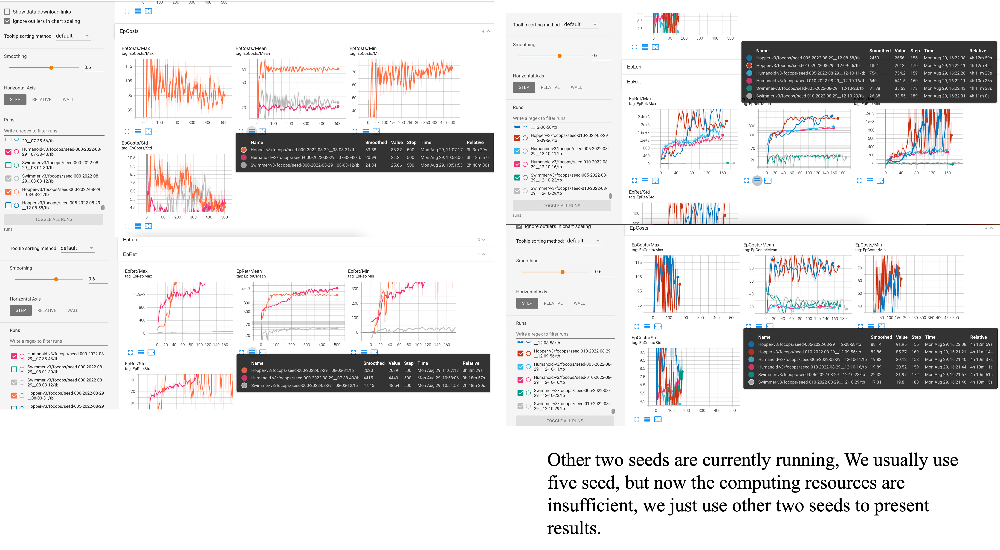

## For reviewer:
Run
```
python train.py --algo focops --env-id Humanoid-v3 --cores 20
python train.py --algo focops --env-id Swimmer-v3 --cores 20
python train.py --algo focops --env-id Hopper-v3 --cores 20

```

