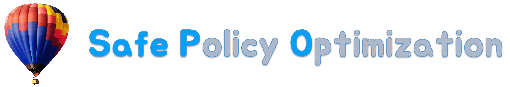
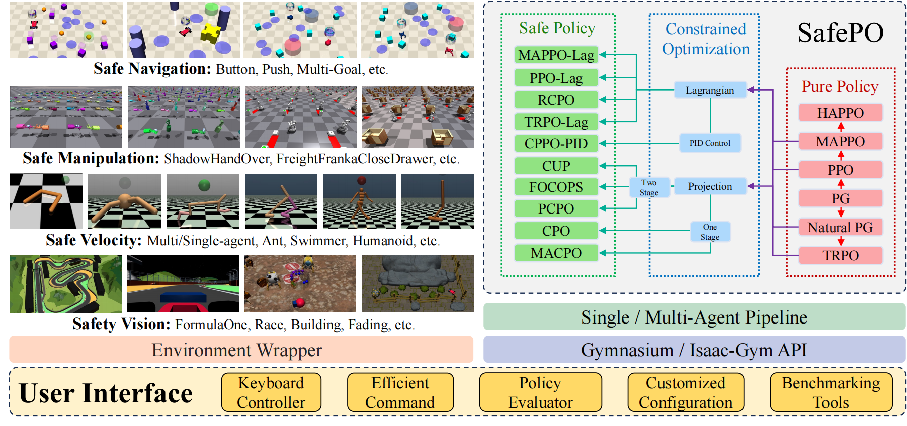

# SafePO-Baselines



[](https://github.com/PKU-MARL "Organization")[](https://github.com/PKU-MARL "Unittest")[](https://github.com/PKU-MARL "Docs")[](https://github.com/PKU-MARL/DexterousHands/blob/main/LICENSE)

**Safe Policy Optimization (Safe PO)**  is a comprehensive benchmark based on Safe Reinforcement Learning (Safe RL). It provides RL research community with a unified platform for processing and evaluating algorithms in various safe reinforcement learning environments. In order to better help the community study this problem, Safe PO is developed with the following key features:

- **Comprehensive RL benchmark**: We offer high-quality implementation of both single-agent and multi-agent safe reinforcement learning algorithms, including cpo, pcpo, trpo-lag, ppo-lag, focops, macpo, mappo-lag, hatrpo, etc.
- **Richer interfaces**：In SafePO, you can modify the parameters of the algorithm according to your requirements. We provide customizable YAML files for each algorithm, and you can also pass in the parameters you want to change via argparse at the terminal.
- **Fairer and more effective**：In the past, when comparing different algorithms, the number of interactions of each algorithm and the processing mode of buffer may be different. To solve this problem, we abstracted the most basic Policy Gradient class and inherited all other algorithms from this class to ensure a fairer and more reasonable performance comparison. In order to improve efficiency, we also support the parallelization of multi-core CPU, which greatly accelerates algorithm development and verification.
- **More information**：We provide rich data visualization methods. Reinforcement learning algorithms typically involves huge number of parameters. In order to better understand the changes of each parameter in the training process, we use log files and Tensorboard to visualize them. We believe this will help developers tune each algorithm more efficiently.

<div align=center>

</div>
- [SafePO-Baselines](#safepo-baselines)
  - [Overview of Algorithms](#overview-of-algorithms)
  - [Supported Environments](#supported-environments)
    - [Installation](#installation)
  - [Conda-Environment](#conda-environment)
  - [Machine Configuration](#machine-configuration)
  - [Getting Started](#getting-started)
    - [Single-Agent](#single-agent)
    - [Multi-Agent](#multi-agent)
  - [PKU-MARL Team](#pku-marl-team)

## Overview of Algorithms
Here we provide a table of Safe RL algorithms that the benchmark includes.

**This work is currently under review. We have already implemented and tested five more algorithms: PDO, RCPO, CPPO-Pid, IPO, SAC-Lag. We will add them into the repository as soon as possible.**

|Algorithm| Proceedings&Cites| Official Code Repo | Official Code Last Update | Official Github Stars |
|:-------------:|:------------:|:---------------------------:|---------------|---------------|
|[PPO-Lag](https://cdn.openai.com/safexp-short.pdf)| &cross; | [Tensorflow 1 ](https://github.com/openai/safety-starter-agents)|  | [](https://github.com/openai/safety-starter-agents/stargazers) |
|[TRPO-Lag](https://cdn.openai.com/safexp-short.pdf)| &cross; | [Tensorflow 1](https://github.com/openai/safety-starter-agents) |  | [](https://github.com/openai/safety-starter-agents/stargazers) |
|[FOCOPS](https://arxiv.org/pdf/2002.06506.pdf) | Neurips 2020 (Cite: 27) | [Pytorch](https://github.com/ymzhang01/focops) |  | [](https://github.com/ymzhang01/focops/stargazers) |
|[CPO](https://arxiv.org/abs/1705.10528) | ICML 2017(Cite: 663) | &cross; | &cross; | &cross; |
|[PCPO](https://arxiv.org/pdf/2010.03152.pdf) | ICLR 2020(Cite: 67) | [Theano](https://sites.google.com/view/iclr2020-pcpo) | &cross; | &cross; |
|[P3O](https://arxiv.org/pdf/2205.11814.pdf) | IJCAI 2022(Cite: 0) | &cross; | &cross; | &cross; |
|[IPO](https://ojs.aaai.org/index.php/AAAI/article/view/5932/5788) | AAAI 2020(Cite: 47) | &cross; | &cross; | &cross; |
|PDO | &cross; | &cross; | &cross; | &cross; |
|[RCPO](https://arxiv.org/pdf/1805.11074.pdf) | ICLR 2019 (cite: 238) | &cross; | &cross; | &cross; |
|[CPPO-PID](https://arxiv.org/pdf/2007.03964.pdf) | Neurips 2020(Cite: 71) | [Pytorch](https://github.com/astooke/rlpyt/tree/master/rlpyt/projects/safe) |  | [](https://github.com/astooke/rlpyt/stargazers) |
|[MACPO](https://arxiv.org/pdf/2110.02793.pdf) | Preprint(Cite: 4) | [Pytorch](https://github.com/chauncygu/Multi-Agent-Constrained-Policy-Optimisation) |  | [](https://github.com/chauncygu/Safe-Multi-Agent-Isaac-Gym/stargazers) |
|[MAPPO_Lagrangian](https://arxiv.org/pdf/2110.02793.pdf) | Preprint(Cite: 4) | [Pytorch](https://github.com/chauncygu/Multi-Agent-Constrained-Policy-Optimisation) |  | [](https://github.com/chauncygu/Safe-Multi-Agent-Isaac-Gym/stargazers) |
|[HATRPO](https://arxiv.org/pdf/2109.11251.pdf) | ICLR 2022 (Cite: 10) | [Pytorch](https://github.com/cyanrain7/TRPO-in-MARL) |   | [](https://github.com/cyanrain7/TRPO-in-MARL/stargazers) |
|[HAPPO (Purely reward optimisation)](https://arxiv.org/pdf/2109.11251.pdf) | ICLR 2022 (Cite: 10) | [Pytorch](https://github.com/cyanrain7/TRPO-in-MARL) |   | [](https://github.com/cyanrain7/TRPO-in-MARL/stargazers) |
|[MAPPO (Purely reward optimisation)](https://arxiv.org/pdf/2103.01955.pdf) | Preprint(Cite: 98) | [Pytorch](https://github.com/marlbenchmark/on-policy) |   | [](https://github.com/marlbenchmark/on-policy/stargazers) |
|[IPPO (Purely reward optimisation)](https://arxiv.org/pdf/2011.09533.pdf) | Preprint(Cite: 28) | &cross; | &cross; | &cross; |


## Supported Environments
> For detailed instructions, please refer to [Environments.md](Environments.md).

### Installation

To use SafePO-Baselines, you need to install environments. Please refer to [Mujoco](https://mujoco.org/), [Safety_gym](https://github.com/openai/safety-gym), [Bullet_gym](https://github.com/SvenGronauer/Bullet-Safety-Gym/tree/master/bullet_safety_gym/envs) for more details on installation. Details regarding the installation of IsaacGym can be found [here](https://developer.nvidia.com/isaac-gym). We currently support the `Preview Release 3` version of IsaacGym.

## Conda-Environment

```python
conda create -n safe python=3.8
conda activate safe
# because the cuda version, we recommend you install pytorch manual.
pip install torch==1.8.0+cu111 torchvision==0.9.0+cu111 torchaudio==0.8.0 -f https://download.pytorch.org/whl/torch_stable.html
pip install -e .
```
> For detailed instructions, please refer to [Installation.md](Installation.md).

## Machine Configuration

We test all algorithms and experiments in **CPU: AMD Ryzen Threadripper PRO 3975WX 32-Cores** and **GPU: NVIDIA GeForce RTX 3090, Driver Version: 495.44**.

## Getting Started
### Single-Agent
All algorithm codes are in file:Parallel_algorithm, for example, if you want to run ppo_lagrangian in safety_gym:Safexp-PointGoal1-v0, with cpu cores:4, seed:0,

```
python train.py --env_id Safexp-PointGoal1-v0 --algo ppo_lagrangian --cores 4
```

|  Argprase   | default  | info|
|  ----       | ----  | ----|
| --algo       | required | the name of algorithm exec |
| --cores | int| the number of cpu physical cores you use|
| --seed | int| the seed you use|
| --check_freq       | int: 25 | check the snyc parameter |
| --entropy_coef | float:0.01| the parameter of entropy|
| --gamma| float:0.99 | the value of dicount|
| --lam | float: 0.95 | the value of GAE lambda |
| --lam_c| float: 0.95| the value of GAE cost lambda |
| --max_ep_len | int: 1000| unless environment have the default value else, we take 1000 as default value|
| --max_grad_norm| float: 0.5| the clip of parameters|
| --num_mini_batches| int: 16| used for value network tranining|
| --optimizer| Adam | the optimizer of Policy other : SGD, other class in torch.optim|
| --pi_lr | float: 3e-4| the learning rate of policy|
| --steps_per_epoch| int: 32000| the number of interactor steps|
| --target_kl | float: 0.01| the value of trust region|
| --train_pi_iterations| int: 80| the number of policy learn iterations|
| --train_v_iterations| int: 40| the number of value network and cost value network iterations|
| --use_cost_value_function| bool: False| use cost_value_function or not|
|--use_entropy|bool:False| use entropy or not|
|--use_reward_penalty| bool:False| use reward_penalty or not|

E.g. if we want use trpo_lagrangian in environment: with 10 cores and seed:0, we can run the following command:
```
python train.py --algo trpo_lagrangian --env_id Safexp-PointGoal1-v0 --cores 10 --seed 0
```
### Multi-Agent
**We change the files layout, the marl usage will update as soon as possible.**
This repository provides a safe MARL baseline benchmark for safe MARL research on challenging tasks of safety DexterousHands (which is developed for MARL, named as Safe MAIG, for details, see [Safe MAIG](https://github.com/chauncygu/Safe-Multi-Agent-Isaac-Gym)), in which the [MACPO](https://arxiv.org/pdf/2110.02793.pdf), [MAPPO-lagrangian](https://arxiv.org/pdf/2110.02793.pdf), [MAPPO](https://arxiv.org/abs/2103.01955), [HAPPO](https://arxiv.org/abs/2109.11251), [IPPO](https://arxiv.org/abs/2011.09533) are all implemented to investigate the safety and reward performance.


>Installation

Details regarding installation of IsaacGym can be found [here](https://developer.nvidia.com/isaac-gym). We currently support the `Preview Release 3` version of IsaacGym.

> Pre-requisites

The code has been tested on Ubuntu 18.04 with Python 3.7. The minimum recommended NVIDIA driver
version for Linux is `470` (dictated by support of IsaacGym).

It uses [Anaconda](https://www.anaconda.com/) to create virtual environments.
To install Anaconda, follow instructions [here](https://docs.anaconda.com/anaconda/install/linux/).

Ensure that Isaac Gym works on your system by running one of the examples from the `python/examples`
directory, like `joint_monkey.py`. Follow troubleshooting steps described in the Isaac Gym Preview 2
install instructions if you have any trouble running the samples.

> install this repo
Once Isaac Gym is installed and samples work within your current python environment, install marl package ```algos/marl``` with:

```bash
pip install -e .
```

> Running the benchmarks

To train your first policy, run this line in ```algos/marl```:

```bash
python train.py --task=ShadowHandOver --algo=macpo
```

> Select an algorithm

To select an algorithm, pass `--algo=ppo/mappo/happo/hatrpo` in ```algos/marl```
as an argument:

```bash
python train.py --task=ShadowHandOver --algo=macpo
```

> Select tasks

Source code for tasks can be found in `dexteroushandenvs/tasks`.

Until now we only suppose the following environments:

|           Environments            |                        ShadowHandOver                        |                   ShadowHandCatchUnderarm                    |                  ShadowHandTwoCatchUnderarm                  |                    ShadowHandCatchAbreast                    |                   ShadowHandOver2Underarm                    |
| :-------------------------------: | :----------------------------------------------------------: | :----------------------------------------------------------: | :----------------------------------------------------------: | :----------------------------------------------------------: | :----------------------------------------------------------: |
|            Description            | These environments involve two fixed-position hands. The hand which starts with the object must find a way to hand it over to the second hand. | These environments again have two hands, however now they have some additional degrees of freedom that allows them to translate/rotate their centre of masses within some constrained region. | These environments involve coordination between the two hands so as to throw the two objects between hands (i.e. swapping them). | This environment is similar to ShadowHandCatchUnderarm, the difference is that the two hands are changed from relative to side-by-side posture. | This environment is is made up of half ShadowHandCatchUnderarm and half ShadowHandCatchOverarm, the object needs to be thrown from the vertical hand to the palm-up hand |
|           Actions Type            |                          Continuous                          |                          Continuous                          |                          Continuous                          |                          Continuous                          |                          Continuous                          |
|         Total Action Num          |                              40                              |                              52                              |                              52                              |                              52                              |                              52                              |
|           Action Values           |                           [-1, 1]                            |                           [-1, 1]                            |                           [-1, 1]                            |                           [-1, 1]                            |                           [-1, 1]                            |
|   Action Index and Description    |                      [detail](#action1)                      |                      [detail](#action2)                      |                      [detail](#action3)                      |                      [detail](#action4)                      |                      [detail](#action5)                      |
|         Observation Shape         |                      (num_envs, 2, 211)                      |                      (num_envs, 2, 217)                      |                      (num_envs, 2, 217)                      |                      (num_envs, 2, 217)                      |                      (num_envs, 2, 217)                      |
|        Observation Values         |                           [-5, 5]                            |                           [-5, 5]                            |                           [-5, 5]                            |                           [-5, 5]                            |                           [-5, 5]                            |
| Observation Index and Description |                       [detail](#obs1)                        |                       [detail](#obs2)                        |                       [detail](#obs3)                        |                       [detail](#obs4)                        |                       [detail](#obs4)                        |
|            State Shape            |                      (num_envs, 2, 398)                      |                      (num_envs, 2, 422)                      |                      (num_envs, 2, 422)                      |                      (num_envs, 2, 422)                      |                      (num_envs, 2, 422)                      |
|           State Values            |                           [-5, 5]                            |                           [-5, 5]                            |                           [-5, 5]                            |                           [-5, 5]                            |                           [-5, 5]                            |
|              Rewards              | Rewards is the pose distance between object and goal. You can check out the details [here](#r1) | Rewards is the pose distance between object and goal. You can check out the details [here](#r2) | Rewards is the pose distance between object and goal. You can check out the details [here](#r3) | Rewards is the pose distance between two object and  two goal, this means that both objects have to be thrown in order to be swapped over. You can check out the details [here](#r4) | Rewards is the pose distance between object and goal. You can check out the details [here](#r2) |
|               Demo                |  |  |  |  |  |


## PKU-MARL Team
The Baseline is a project contributed by MARL team at Peking University, please contact yaodong.yang@pku.edu.cn if you are interested to collaborate.
We also thank the list of contributors from the following open source repositories:
[Spinning Up](https://spinningup.openai.com/en/latest/), [Bullet-Safety-Gym](https://github.com/SvenGronauer/Bullet-Safety-Gym/tree/master/bullet_safety_gym/envs), [SvenG](https://github.com/SvenGronauer/RL-Safety-Algorithms), [Safety Gym](https://github.com/openai/safety-gym).
