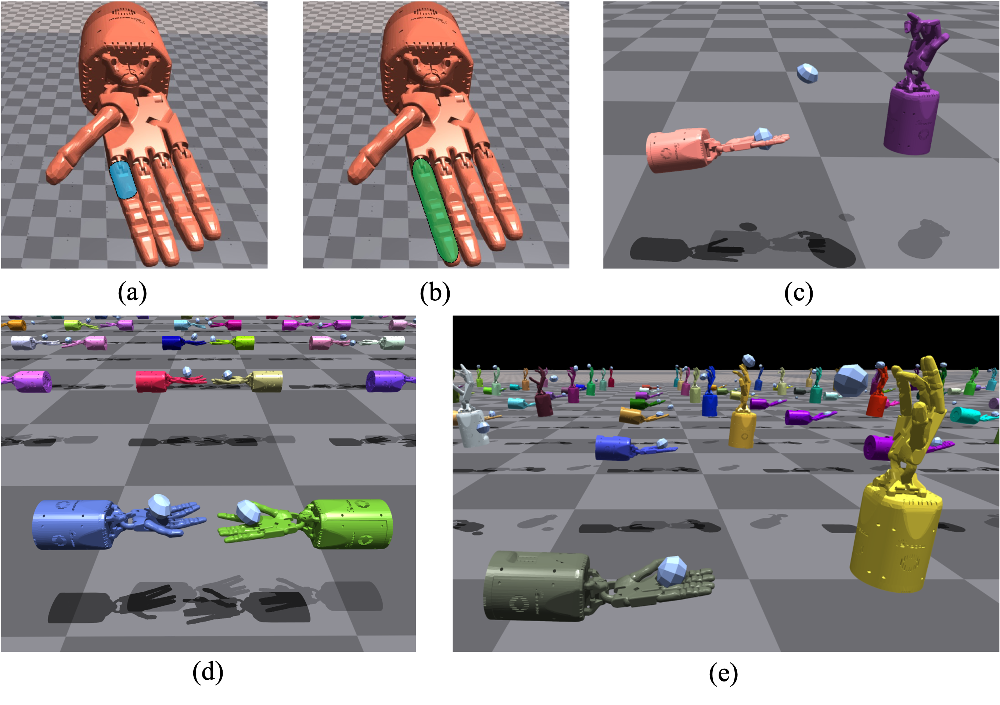
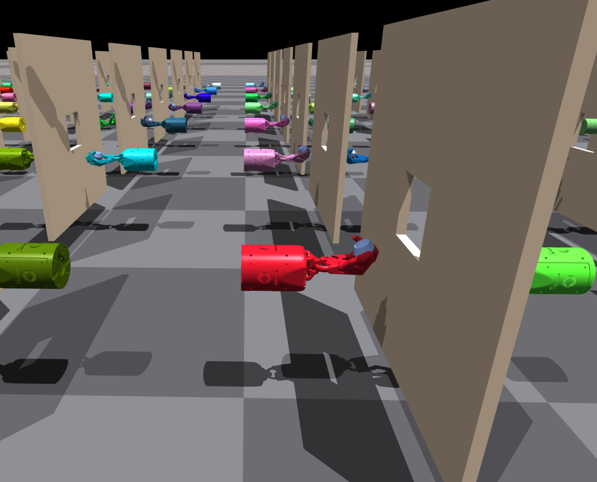
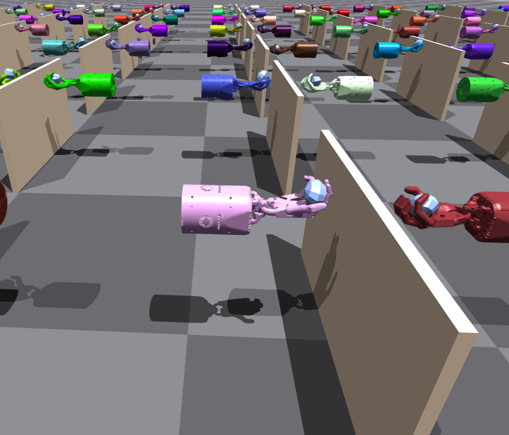
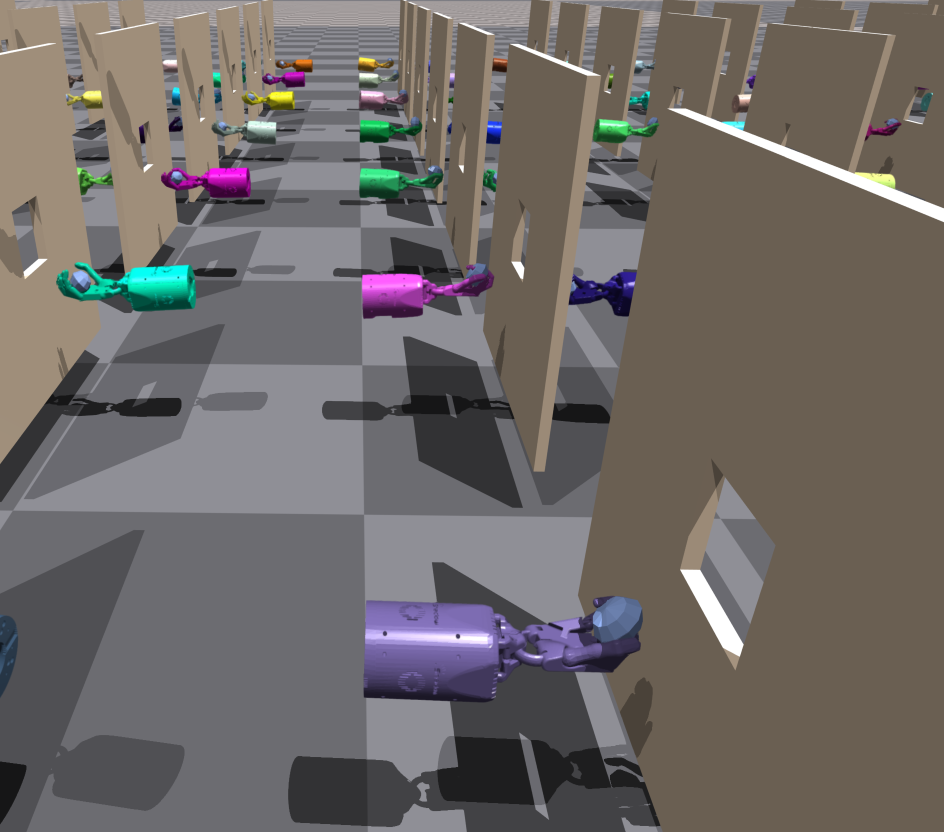
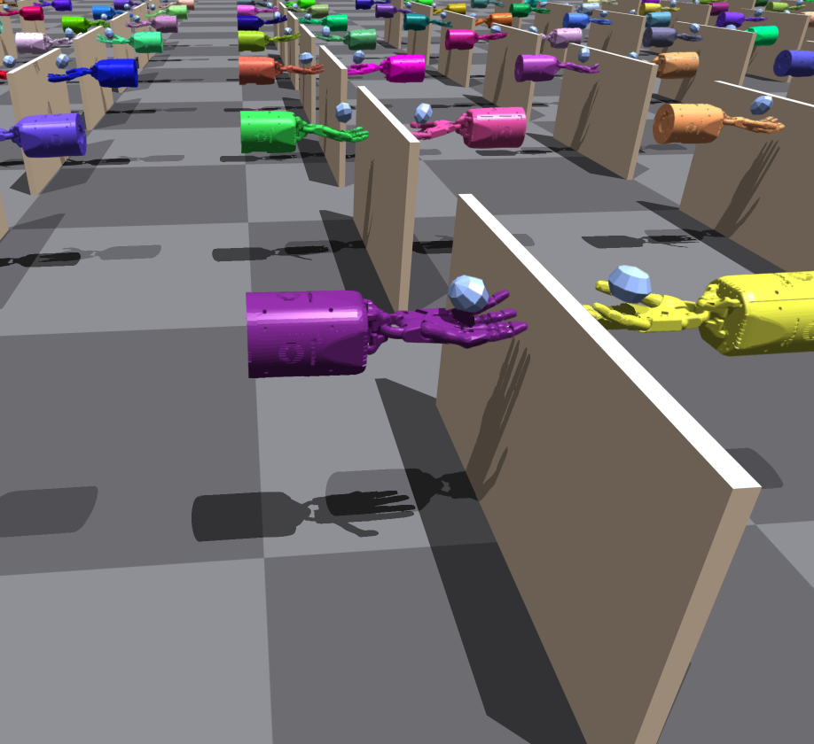
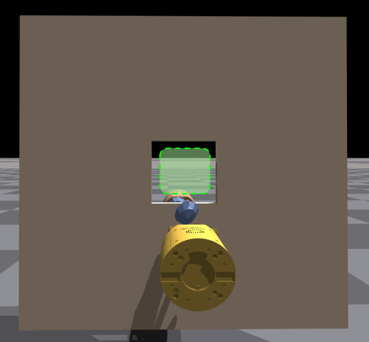
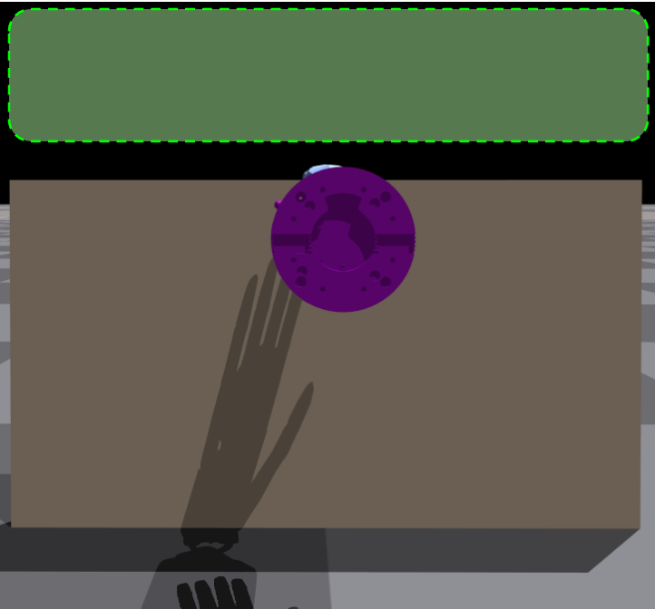

# SafePO-Baselines


[](https://github.com/PKU-MARL "Organization")[](https://github.com/PKU-MARL "Unittest")[](https://github.com/PKU-MARL "Docs")[](https://github.com/PKU-MARL/DexterousHands/blob/main/LICENSE)

**Safe Policy Optimization (SafePO)**  is a comprehensive algorithm benchmark for Safe Reinforcement Learning (Safe RL). It provides RL research community with a unified platform for processing and evaluating algorithms in various safe reinforcement learning environments. In order to better help the community study this problem, SafePO is developed with the following key features:

- **Comprehensive Safe RL benchmark**: We offer high-quality implementation of both single-agent safe reinforcement learning algorithms (CPO, PCPO, FOCOPS, P3O, PPO-Lagrangian, TRPO-Lagrangian, PDO, CPPO-PID, RCPO, IPO, and SAC-Lagrangian) and multi-agent safe reinforcement learning algorithms (HAPPO, HAPPO-Lagrangian, IPPO, MACPO, and MAPPO).
- **Richer interfaces**：In SafePO, you can modify the parameters of the algorithm according to your requirements. We provide customizable YAML files for each algorithm, and you can also pass in the parameters you want to change via argparse at the terminal.
- **Fairer and more effective**：In the past, when comparing different algorithms, the number of interactions of each algorithm and the processing mode of buffer may be different. To solve this problem, we abstract the most basic Policy Gradient class and inherit all other algorithms from this class to ensure a fairer and more reasonable performance comparison. In order to improve efficiency, we also support multi-core CPU parallelization, which greatly accelerates algorithm development and verification.
- **More information**：We provide rich data visualization methods. Reinforcement learning algorithms typically involves huge number of parameters. In order to better understand the changes of each parameter in the training process, we use log files, TensorBoard, and wandb to visualize them. We believe this will help developers tune each algorithm more efficiently.

<div align=center>

</div>

- [SafePO-Baselines](#safepo-baselines)
  - [Overview of Algorithms](#overview-of-algorithms)
  - [Supported Environments](#supported-environments)
  - [Pre-requisites](#pre-requisites)
  - [Conda-Environment](#conda-environment)
  - [Getting Started](#getting-started)
    - [Single-Agent](#single-agent)
    - [Multi-Agent](#multi-agent)
    - [Selected Tasks](#selected-tasks)
  - [What's More](#whats-more)
  - [Machine Configuration](#machine-configuration)
  - [PKU-MARL Team](#pku-marl-team)

## Overview of Algorithms
Here we provide a table of Safe RL algorithms that the benchmark includes.

**This work is currently under review. We have already implemented and tested five more algorithms: PDO, RCPO, CPPO-PID, IPO, SAC-Lag. We will add them into the repository as soon as possible.**

|Algorithm| Proceedings&Cites| Official Code Repo | Official Code Last Update | Official Github Stars |
|:-------------:|:------------:|:---------------------------:|:---------------:|:---------------:|
|[PPO-Lag](https://cdn.openai.com/safexp-short.pdf)| :x: | [Tensorflow 1 ](https://github.com/openai/safety-starter-agents)|  | [](https://github.com/openai/safety-starter-agents/stargazers) |
|[TRPO-Lag](https://cdn.openai.com/safexp-short.pdf)| :x: | [Tensorflow 1](https://github.com/openai/safety-starter-agents) |  | [](https://github.com/openai/safety-starter-agents/stargazers) |
|[FOCOPS](https://arxiv.org/pdf/2002.06506.pdf) | Neurips 2020 (Cite: 27) | [Pytorch](https://github.com/ymzhang01/focops) |  | [](https://github.com/ymzhang01/focops/stargazers) |
|[CPO](https://arxiv.org/abs/1705.10528) | ICML 2017(Cite: 663) | :x: | :x: | :x: |
|[PCPO](https://arxiv.org/pdf/2010.03152.pdf) | ICLR 2020(Cite: 67) | [Theano](https://sites.google.com/view/iclr2020-pcpo) | :x: | :x: |
|[P3O](https://arxiv.org/pdf/2205.11814.pdf) | IJCAI 2022(Cite: 0) | :x: | :x: | :x: |
|[IPO](https://ojs.aaai.org/index.php/AAAI/article/view/5932/5788) | AAAI 2020(Cite: 47) | :x: | :x: | :x: |
|PDO | :x: | :x: | :x: | :x: |
|[RCPO](https://arxiv.org/pdf/1805.11074.pdf) | ICLR 2019 (Cite: 238) | :x: | :x: | :x: |
|[CPPO-PID](https://arxiv.org/pdf/2007.03964.pdf) | Neurips 2020(Cite: 71) | [Pytorch](https://github.com/astooke/rlpyt/tree/master/rlpyt/projects/safe) |  | [](https://github.com/astooke/rlpyt/stargazers) |
|[MACPO](https://arxiv.org/pdf/2110.02793.pdf) | Preprint(Cite: 4) | [Pytorch](https://github.com/chauncygu/Multi-Agent-Constrained-Policy-Optimisation) |  | [](https://github.com/chauncygu/Safe-Multi-Agent-Isaac-Gym/stargazers) |
|[MAPPO_Lagrangian](https://arxiv.org/pdf/2110.02793.pdf) | Preprint(Cite: 4) | [Pytorch](https://github.com/chauncygu/Multi-Agent-Constrained-Policy-Optimisation) |  | [](https://github.com/chauncygu/Safe-Multi-Agent-Isaac-Gym/stargazers) |
|[HATRPO](https://arxiv.org/pdf/2109.11251.pdf) | ICLR 2022 (Cite: 10) | [Pytorch](https://github.com/cyanrain7/TRPO-in-MARL) |   | [](https://github.com/cyanrain7/TRPO-in-MARL/stargazers) |
|[HAPPO (Purely reward optimisation)](https://arxiv.org/pdf/2109.11251.pdf) | ICLR 2022 (Cite: 10) | [Pytorch](https://github.com/cyanrain7/TRPO-in-MARL) |   | [](https://github.com/cyanrain7/TRPO-in-MARL/stargazers) |
|[MAPPO (Purely reward optimisation)](https://arxiv.org/pdf/2103.01955.pdf) | Preprint(Cite: 98) | [Pytorch](https://github.com/marlbenchmark/on-policy) |   | [](https://github.com/marlbenchmark/on-policy/stargazers) |
|[IPPO (Purely reward optimisation)](https://arxiv.org/pdf/2011.09533.pdf) | Preprint(Cite: 28) | :x: | :x: | :x: |


## Supported Environments
> For detailed instructions, please refer to [Environments.md](Environments.md).

## Pre-requisites

To use SafePO-Baselines, you need to install environments. Please refer to [Mujoco](https://mujoco.org/), [Safety-Gym](https://github.com/openai/safety-gym), [Bullet-Safety-Gym](https://github.com/SvenGronauer/Bullet-Safety-Gym/tree/master/bullet_safety_gym/envs) for more details on installation. Details regarding the installation of IsaacGym can be found [here](https://developer.nvidia.com/isaac-gym). We currently support the `Preview Release 3` version of IsaacGym.

## Conda-Environment

```python
conda create -n safe python=3.8
conda activate safe
# because the cuda version, we recommend you install pytorch manual.
pip install torch==1.8.0+cu111 torchvision==0.9.0+cu111 torchaudio==0.8.0 -f https://download.pytorch.org/whl/torch_stable.html
pip install -e .
conda install mpi4py
conda install scipy
```
> For detailed instructions, please refer to [Installation.md](Installation.md).


## Getting Started
### Single-Agent

`train.py` is the entrance file. Running `train.py` with arguments about algorithms and environments does the training. For example, to run PPO-Lagrangian in Safexp-PointGoal1-v0, with 4 cpu cores and seed 0, you can use the following command:

```
python train.py --env_id Safexp-PointGoal1-v0 --algo ppo_lagrangian --cores 4 --seed 0
```

Here we provide the list of common arguments: 

|  Argument   | Default  | Info |
|  ----       | ----  | ----|
| --algo       | required | the name of algorithm exec |
| --cores | int| the number of cpu physical cores you use|
| --seed | int| the seed you use|
| --check_freq       | int: 25 | check the snyc parameter |
| --entropy_coef | float:0.01| the parameter of entropy|
| --gamma| float:0.99 | the value of dicount|
| --lam | float: 0.95 | the value of GAE lambda |
| --lam_c| float: 0.95| the value of GAE cost lambda |
| --max_ep_len | int: 1000| unless environment have the default value else, we take 1000 as default value|
| --max_grad_norm| float: 0.5| the clip of parameters|
| --num_mini_batches| int: 16| used for value network tranining|
| --optimizer| Adam | the optimizer of Policy other : SGD, other class in torch.optim|
| --pi_lr | float: 3e-4| the learning rate of policy|
| --steps_per_epoch| int: 32000| the number of interactor steps|
| --target_kl | float: 0.01| the value of trust region|
| --train_pi_iterations| int: 80| the number of policy learn iterations|
| --train_v_iterations| int: 40| the number of value network and cost value network iterations|
| --use_cost_value_function| bool: False| use cost_value_function or not|
|--use_entropy|bool:False| use entropy or not|
|--use_reward_penalty| bool:False| use reward_penalty or not|


### Multi-Agent
We also provide a safe MARL algorithm benchmark for safe MARL research on the challenging tasks of Safety DexterousHands. HAPPO, HAPPO-Lagrangian, IPPO, MACPO, and MAPPO have already been implemented.

```safepo/envs/safe_dexteroushands/train_marl.py``` is the entrance file. Running `train_marl.py` with arguments about algorithms and tasks does the training. For example, you can use the following command:

```bash
python train_marl.py --task=ShadowHandOver --algo=macpo
```

### Selected Tasks
| Base Environments             | Description                                                                                                                                                           | Demo |
|-------------------------------|-----------------------------------------------------------------------------------------------------------------------------------------------------------------------|------|
| ShadowHandOver                | These environments involve two fixed-position hands. The hand which starts with the object must find a way to hand it over to the second hand.                        |      |
| ShadowHandCatchOver2Underarm | This environment is made up of half ShadowHandCatchUnderarm and half ShadowHandCatchOverarm, the object needs to be thrown from the vertical hand to the palm-up hand |      |


**We implement some different constraints to the base environments, expanding the setting to both single-agent and multi-agent.**

 


## What's More
Our team has also designed a number of more interesting safety tasks for two-handed dexterous manipulation, and this work will soon be releasing code for use by more Safe RL researchers.
| Base Environments             | Description                                                                                                                                                           | Demo |
|-------------------------------|-----------------------------------------------------------------------------------------------------------------------------------------------------------------------|------|
| ShadowHandOverWall                | None                        |      |
| ShadowHandOverWallDown | None |      |
| ShadowHandCatchOver2UnderarmWall                | None                        |      |
| ShadowHandCatchOver2UnderarmWallDown | None |      |

And the safe region are :
|  Wall   | Wall Down  | 
|  ----       | ----  |
|        |      |

## Machine Configuration

We test all algorithms and experiments on **CPU: AMD Ryzen Threadripper PRO 3975WX 32-Cores** and **GPU: NVIDIA GeForce RTX 3090, Driver Version: 495.44**.

## PKU-MARL Team
The Baseline is a project contributed by MARL team at Peking University, please contact yaodong.yang@pku.edu.cn if you are interested to collaborate.
We also thank the list of contributors of the following open source repositories:
[Spinning Up](https://spinningup.openai.com/en/latest/), [Bullet-Safety-Gym](https://github.com/SvenGronauer/Bullet-Safety-Gym/tree/master/bullet_safety_gym/envs), [SvenG](https://github.com/SvenGronauer/RL-Safety-Algorithms), [Safety-Gym](https://github.com/openai/safety-gym).
